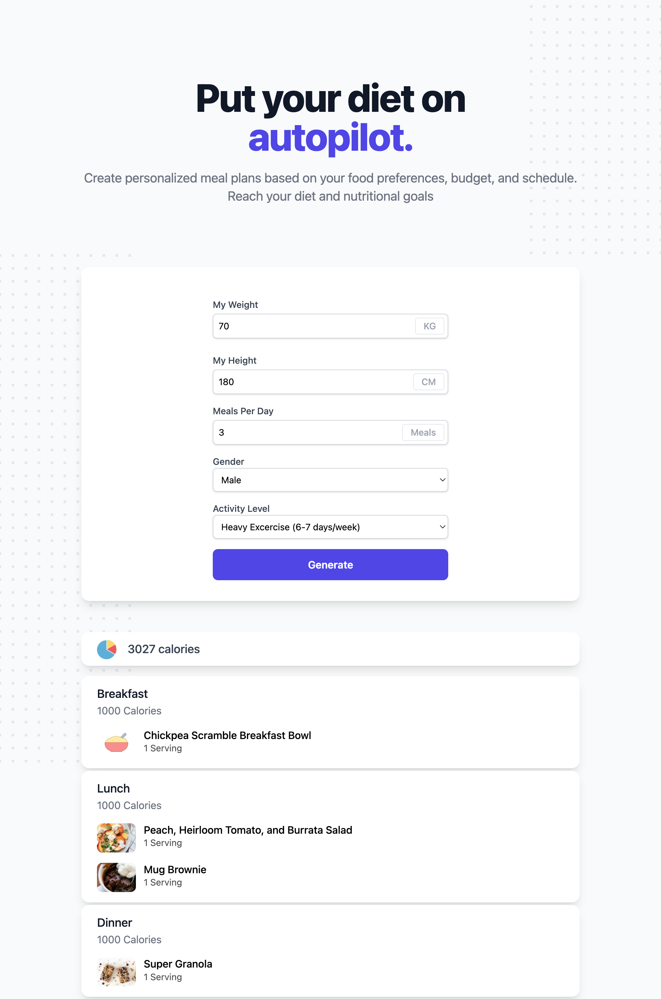

# TDEE Meal Planner



A personalised meal plan generator built around the **Mifflin-St Jeor TDEE equation**. Enter your stats and activity level, and the app calculates your daily calorie target and assembles a randomised meal plan split across up to four meal slots — served through a clean Tailwind CSS web interface backed by a Flask API.

---

## How It Works

1. The user submits weight, height, gender, age, meals-per-day, and activity level via the web form
2. The Flask API computes BMR using the Mifflin-St Jeor formula, then multiplies by the activity factor to get TDEE
3. The calorie budget is divided across meal slots (e.g. 35/25/20/20 for a 4-meal split)
4. For each slot, the planner shuffles the corresponding food database and picks the item(s) whose calorie count is closest to the slot's budget
5. The assembled plan is returned as JSON and rendered in the browser without a page reload

---

## Features

- **Mifflin-St Jeor BMR** — gender-corrected formula (male: +5, female: −161) applied before activity scaling
- **Flexible meal splits** — 1, 2, 3, or 4 meals per day, each with its own calorie proportion
- **Randomised selection** — food database is shuffled on every request so plans vary day to day
- **Single-page UI** — Tailwind CSS form, XHR request, results rendered dynamically without reload
- **Modular food data** — breakfast, main dishes, and snacks in separate modules; swap or extend without touching logic

---

## Stack

- **Backend:** Python 3, Flask
- **Frontend:** HTML, Tailwind CSS (CDN), vanilla JS (XHR)
- **Algorithm:** Mifflin-St Jeor TDEE, greedy closest-calorie meal picker

---

## Project Structure

```
tdee-meal-planner/
├── app.py            # Flask app — routes and request handling
├── bmr.py            # Person class — BMR and TDEE calculation
├── generator.py      # Diet plan logic — calorie splitting and meal selection
├── data/
│   ├── breakfast.py  # Breakfast food database
│   ├── maindishes.py # Lunch and dinner food database
│   └── snacks.py     # Snack food database
└── templates/
    └── index.html    # Single-page frontend
```

---

## Setup

**1. Clone the repo**
```bash
git clone https://github.com/candtk/tdee-meal-planner.git
cd tdee-meal-planner
```

**2. Install dependencies**
```bash
pip install flask
```

**3. Run**
```bash
python app.py
```

Navigate to `http://localhost:5000` and fill in your stats.

---

## License

MIT
